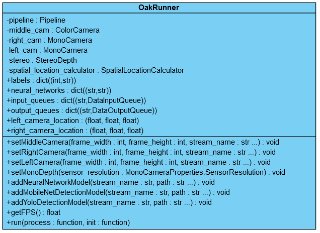

# Généralisation de l'utilisation du OAK-D

Il y a régulièrement des répétitions entre les programmes qui font tourner un modèle sur le OAK-D, c'est pourquoi il me semble important de commencer à créer des fichiers qui regroupent les fonctionnalités communes.

L'idée est de se créer un genre de petite bibliothèque, cela va faire gagner beaucoup de temps. Ces fichiers sont dans le répertoire "utils" et des exemples d'utilisations sont disponibles dans le répertoire "examples".
<br><br>


## Runner

J'ai créé une classe générique qui peut servir de base à nos programmes, l'instancier permet d'avoir un "runner", il suffit de le configurer via l'appel de quelques méthodes, puis, utiliser la méthode "run" en passant en paramètre la fonction appliquant le traitement souhaité.



Cela permet d'écrire un programme en très peu de lignes, voici par exemple, un programme équivalent au [mdn_coronamask](https://github.com/Ikomia-dev/ikomia-oakd/blob/main/III-use_custom_model/3-run_model/as_mobilenetDetectionNetwork/mdn_coronamask.py) du point [III.3](https://github.com/Ikomia-dev/ikomia-oakd/tree/main/III-use_custom_model/3-run_model) (qui comptabilise environ 80 lignes).

```py
from OakRunner import OakRunner
import cv2

# Fonction appelée à chaque itération de la boucle de traitement
def process(runner):
    frame = runner.output_queues["middle_cam"].get().getCvFrame()
    detections = runner.output_queues["nn"].get().detections
    for det in detections:
        topleft = (int(det.xmin*300), int(det.ymin*300))
        botright = (int(det.xmax*300), int(det.ymax*300))
        cv2.rectangle(frame, topleft, botright, (255,0,0), 2)
        cv2.putText(frame, runner.labels[det.label] + f" {int(det.confidence*100)}%", (topleft[0]+10, topleft[1]+20), cv2.FONT_HERSHEY_TRIPLEX, 0.5, (255,0,0))
    cv2.putText(frame, f"fps: {round(runner.getFPS())}", (2, 300 - 4), cv2.FONT_HERSHEY_TRIPLEX, 0.4, color=(255, 255, 255))
    cv2.imshow("output", frame)

# Instancier le runner
runner = OakRunner() 

# Configurer la caméra centrale
runner.setMiddleCamera(frame_width=300, frame_height=300, stream_name="middle_cam")
middle_cam = runner.getMiddleCamera()
middle_cam.setInterleaved(False)
middle_cam.setFps(20)

# Configurer le réseau de neurones
runner.addMobileNetDetectionModel(stream_name="nn", path="/chemin/vers/le.blob")
middle_cam.preview.link(runner.neural_networks["nn"].input)
runner.labels = ["background", "no mask", "mask", "no mask"]

# Exécuter la boucle de traitement
runner.run(process=process)
```

Enfin, j'ai implémenté le calcul du nombre d'images par seconde au runner, il est donc possible de récupérer cette information via un simple appel de méthode.

```py
runner.getFPS()
```
<br>


## Fonctionnalités communes

Le runner permet de gagner beaucoup de temps, mais il est possible de faire mieux. Pour se faire, j'ai écris des fichiers regroupant des fonctionnalités communes aux programmes.

Pour l'instant il y en a 3, réparties dans 2 fichiers.
- Afficher le nombre d'images par seconde (utils/draw.py)
- Dessiner les zones d'intérêts (utils/draw.py)
- Configurer le [SpatialLocationCalculator](https://docs.luxonis.com/projects/api/en/latest/references/python/#depthai.SpatialLocationCalculator) (utils/compute.py)
- Formater un tableau 2D en 1D (utils/compute.py)
- Calculer coordonnées vectorielles 3D à partir point 2D (utils/compute.py)
- Déterminer le point d'intersection entre deux vecteurs (utils/compute.py)
- Modéliser des points d'intérêts (utils/visualize.py)

Ainsi, pour reprendre le programme ci-dessus, la fonction process peut désormais être écrite en moins de lignes.

```py
from utils.draw import drawROI, displayFPS

def process(runner):
    frame = runner.output_queues["middle_cam"].get().getCvFrame()
    detections = runner.output_queues["nn"].get().detections
    
    for det in detections:
        drawROI(frame, (det.xmin,det.ymin), (det.xmax,det.ymax),label=runner.labels[det.label], confidence=det.confidence)
    displayFPS(frame, runner.getFPS())
    cv2.imshow("output", frame)
```